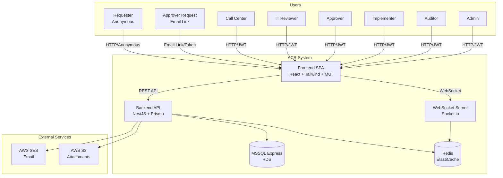

# Design Document: ACR Management System

## Summary
<!-- 10-line max digest for downstream phases. -->
- **Architecture**: Monolithic modular (NestJS modules) — SPA frontend + REST API backend; deployed on AWS (ECS + S3/CloudFront + RDS)
- **Stack**: React + Tailwind + MUI / NestJS (Node.js) / Microsoft SQL Server Express / AWS (ECS, S3, CloudFront, RDS) / Terraform
- **Components**: 9 — Auth, ChangeRequest, Workflow Engine, Approval, Notification, Attachment, AuditLog, Admin, Reporting
- **Entities**: 12 — User, Role, ChangeRequest, WorkflowDefinition, WorkflowStep, WorkflowInstance, Approval, Attachment, AuditLog, Notification, MasterData, Session
- **Endpoints**: ~45 REST endpoints across 9 resource groups
- **Integrations**: AWS SES (email), AWS S3 (attachments), WebSocket/Socket.io (real-time), Redis (caching)
- **Testing**: PBT Yes (workflow state machine, audit immutability, RBAC) — NFR Yes
- **Key Decisions**: NestJS modular architecture, Prisma ORM with MSSQL, Local auth + JWT (AD Phase 2), Configurable workflow engine with versioning

## Architecture

### System Context Diagram

### Technology Stack
- **Frontend**: React 18 + TypeScript + Tailwind CSS + MUI v5 + Vite
- **Backend**: NestJS + TypeScript + Prisma ORM
- **Database**: Microsoft SQL Server Express (RDS for prod, Docker for local)
- **Cache**: Redis (ElastiCache for prod, Docker for local)
- **Real-time**: Socket.io (WebSocket)
- **File Storage**: AWS S3
- **Email**: AWS SES
- **Infrastructure**: AWS (ECS Fargate, S3, CloudFront, RDS, ElastiCache), Terraform, Docker Compose (local)
- **CI/CD**: GitHub Actions
- **Testing**: Jest + Supertest + Playwright + fast-check (PBT)
- **Observability**: Winston + AWS CloudWatch
- **Key Libraries**: @nestjs/swagger, @nestjs/passport, bcrypt, zod, react-hook-form, @tanstack/react-query, zustand, socket.io-client

### Key Design Decisions
1. **NestJS modular architecture**: แต่ละ functional area เป็น module แยก (Auth, ChangeRequest, Workflow, Approval, etc.) ทำให้ maintain/test ง่าย และสามารถ scale ได้ในอนาคต
2. **Configurable Workflow Engine with versioning**: Workflow definition เก็บใน DB ไม่ใช่ hardcoded; เมื่อ admin แก้ไข workflow, CR ที่อยู่ระหว่างดำเนินการใช้ version เดิม; CR ใหม่ใช้ version ใหม่
3. **Local auth + JWT (AD Phase 2)**: ระบบจัดการ user/password เอง (register, login, forgot password); Requester ไม่ต้อง login (anonymous with tracking token); AD integration เป็น Phase 2
4. **Immutable audit log**: append-only table, no UPDATE/DELETE permissions, separate from business data

## Open Questions & Risks

| # | Question/Risk | Impact | Status |
|---|--------------|--------|--------|
| 1 | Prisma MSSQL support maturity (preview feature) — fallback: TypeORM | Medium | Open |
| 2 | AWS SES email delivery rate limits for approval notifications | Low | Mitigated (SES production access) |
| 3 | Redis single point of failure in local dev | Low | Mitigated (graceful degradation) |
| 4 | Workflow engine complexity — admin creates invalid flows | Medium | Mitigated (validation on save) |

## Detailed Specifications

- [Components](design/components.md) — component breakdown and interfaces
- [Data Model](design/data-model.md) — entities, relationships, schemas
- [API Specification](design/api-spec.md) — endpoints and contracts
- [Integration](design/integration.md) — external services and real-time communication
- [Implementation](design/implementation.md) — directory structure, setup, conventions
- [Non-Functional Requirements](design/nfr.md) — performance, security, infrastructure
- [Correctness Properties](design/correctness.md) — PBT specifications

## External References

| Source | Type | Used in |
|--------|------|---------|
| initial-requirements/Usecase-APP-02-ACR Management System.md | Requirements (source of truth) | All design files |
