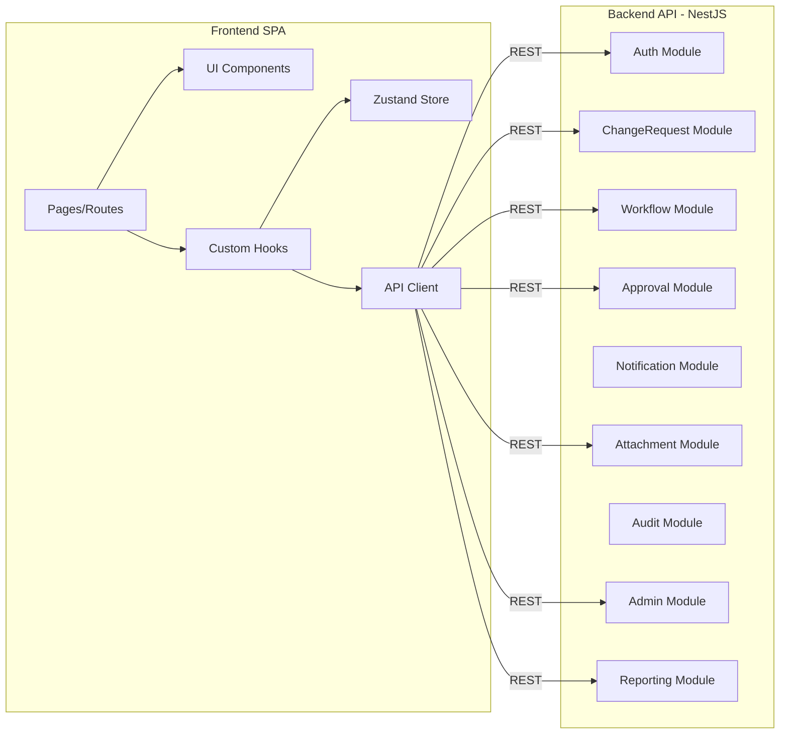
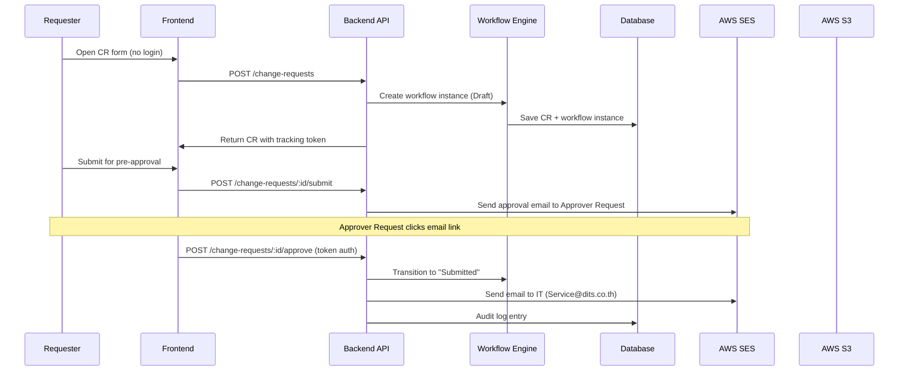

# Components

## Overview
ระบบ ACR Management System ใช้สถาปัตยกรรม NestJS Modular — แต่ละ functional area เป็น module แยก มี controller, service, repository layer ของตัวเอง Frontend เป็น React SPA ที่เรียก backend REST API ผ่าน TanStack Query



---

## Auth Module

**Purpose**: จัดการ authentication (local email+password), authorization (RBAC), JWT token management, anonymous access token สำหรับ Requester

**Technology**: NestJS + Passport (local strategy) + bcrypt + JWT

**Responsibilities**:
- Register/Login/Logout/Forgot Password สำหรับ internal users (IT, Admin, etc.)
- Issue JWT access + refresh tokens
- Generate anonymous tracking tokens สำหรับ Requester (ไม่ login)
- Generate approval link tokens สำหรับ Approver Request (email-based)
- RBAC guards — ตรวจสอบ role permissions ทุก request
- Session management (Redis-backed)

**Exposes**:
- `POST /auth/register` — สร้าง account (Admin only)
- `POST /auth/login` — login ด้วย email + password
- `POST /auth/refresh` — refresh JWT
- `POST /auth/forgot-password` — ส่ง reset link
- `POST /auth/reset-password` — reset password
- `GET /auth/verify-token/:token` — verify anonymous/approval token

**Consumes**:
- `AuditModule` — log auth events
- `NotificationModule` — ส่ง email reset password
- `Redis` — session/token store

**Key Decisions**:
1. Local auth ก่อน, AD integration เป็น Phase 2 — ออกแบบ AuthStrategy pattern ที่ plug ได้
2. Anonymous requester ใช้ short-lived token (24h) ผูกกับ email + CR ID
3. Approval link token ใช้ one-time token (72h expiry)

---

## ChangeRequest Module

**Purpose**: CRUD สำหรับ Change Request, จัดการ lifecycle ตั้งแต่ Draft ถึง Closed, เชื่อมกับ Workflow Engine

**Technology**: NestJS + Prisma + Zod validation

**Responsibilities**:
- สร้าง/แก้ไข/ดู CR
- Validate required fields ตาม status/step
- Trigger workflow transitions
- Track version history (field-level change tracking)
- Optimistic locking (version number)
- Search & filter CRs

**Exposes**:
- `POST /change-requests` — สร้าง CR (anonymous or authenticated)
- `GET /change-requests` — list/search (with pagination, filter, sort)
- `GET /change-requests/:id` — get CR detail
- `PATCH /change-requests/:id` — update CR fields
- `POST /change-requests/:id/submit` — submit to next step
- `GET /change-requests/:id/history` — view change history

**Consumes**:
- `WorkflowModule` — get current step, validate transitions, execute transitions
- `AuditModule` — log all changes
- `NotificationModule` — trigger notifications on status change
- `AttachmentModule` — manage files linked to CR

**Key Decisions**:
1. 1 CR = 1 workflow instance — tied at creation
2. Optimistic locking via version field — prevent concurrent overwrites
3. Field-level change tracking stored in AuditLog (not separate history table)

---

## Workflow Module (Engine)

**Purpose**: Configurable workflow engine — จัดการ workflow definitions, steps, conditions, transitions; evaluate routing ตาม conditions

**Technology**: NestJS + State machine pattern + Prisma

**Responsibilities**:
- CRUD workflow definitions (Admin configurable)
- Define steps: name, type (review/approval/implementation/verification), required fields, assigned role
- Define conditions: field-based routing (if Impact=High → go to step X)
- Execute transitions: validate current step → evaluate conditions → move to next step
- Workflow versioning: เมื่อ admin แก้ workflow, CR ที่อยู่ระหว่างดำเนินการใช้ version เดิม
- Validate workflow integrity (has start, has end, no orphan steps)

**Exposes**:
- `GET /workflows` — list workflow definitions
- `POST /workflows` — create workflow definition (Admin)
- `PUT /workflows/:id` — update workflow definition (creates new version)
- `GET /workflows/:id/steps` — get steps for a workflow
- `POST /workflows/:id/steps` — add step
- `PUT /workflows/:id/steps/:stepId` — update step
- `DELETE /workflows/:id/steps/:stepId` — remove step
- `POST /workflows/:id/conditions` — add condition
- `POST /workflows/:id/validate` — validate workflow integrity
- `POST /workflow-instances/:id/transition` — execute transition (internal)

**Consumes**:
- `AuditModule` — log workflow config changes
- `NotificationModule` — notify assigned roles on step entry

**Internal Structure**:
```
workflow/
  ├── controllers/        # REST endpoints for workflow config
  ├── services/
  │   ├── workflow-definition.service.ts   # CRUD definitions
  │   ├── workflow-engine.service.ts       # Execute transitions, evaluate conditions
  │   └── workflow-validator.service.ts    # Validate flow integrity
  ├── models/             # WorkflowDefinition, WorkflowStep, WorkflowCondition, WorkflowInstance
  ├── guards/             # WorkflowTransitionGuard
  └── tests/
```

**Key Decisions**:
1. Workflow definitions stored in DB (not hardcoded) — Admin UI manages them
2. Version immutability: once a CR starts on a workflow version, it stays on that version
3. Default workflow pre-seeded on first deployment (Draft→Submitted→IT Review→Approval→Implementation→Verification→Closed)
4. Conditions evaluated in priority order; first match wins; fallback to default next step

---

## Approval Module

**Purpose**: จัดการ approval flow — submit for approval, approve, reject, Emergency post-approval

**Technology**: NestJS + Prisma

**Responsibilities**:
- Submit CR for approval (validate prerequisites met)
- Record approve/reject with reason
- Route to correct approver based on workflow step config
- Handle Emergency Change post-approval flow
- Enforce BR-010 (approver ≠ implementer) as warning

**Exposes**:
- `POST /change-requests/:id/submit-approval` — submit for approval
- `POST /change-requests/:id/approve` — approve
- `POST /change-requests/:id/reject` — reject (reason required)
- `GET /approvals/pending` — list pending approvals for current user

**Consumes**:
- `WorkflowModule` — validate step allows approval
- `AuditModule` — log approval actions
- `NotificationModule` — notify requester/IT on approve/reject

---

## Notification Module

**Purpose**: จัดการ notifications ทั้ง email (AWS SES) และ in-app (WebSocket)

**Technology**: NestJS + AWS SES SDK + Socket.io + Redis (pub/sub)

**Responsibilities**:
- Send email notifications (status changes, approval requests, tracking links)
- Manage email templates (per notification type)
- Push in-app notifications via WebSocket
- Store notification history (read/unread)
- Queue emails for reliability (with retry)

**Exposes**:
- `GET /notifications` — list user's notifications (paginated)
- `PATCH /notifications/:id/read` — mark as read
- `PATCH /notifications/read-all` — mark all as read
- `WebSocket: notification:new` — real-time push event

**Consumes**:
- `AWS SES` — send emails
- `Redis` — pub/sub for real-time notification delivery
- `AuditModule` — log notification send events

---

## Attachment Module

**Purpose**: จัดการ file upload/download — presigned URLs สำหรับ S3

**Technology**: NestJS + AWS S3 SDK + Multer (validation)

**Responsibilities**:
- Generate presigned upload URLs
- Generate presigned download URLs
- Validate file type (PDF, JPG, PNG, DOCX, XLSX, TXT, LOG) and size (≤10MB configurable)
- Link attachments to CR + specific step
- Delete attachments (soft delete)

**Exposes**:
- `POST /attachments/upload-url` — get presigned upload URL
- `GET /attachments/:id/download-url` — get presigned download URL
- `GET /change-requests/:id/attachments` — list attachments for CR
- `DELETE /attachments/:id` — soft delete

**Consumes**:
- `AWS S3` — storage
- `AuditModule` — log upload/delete events

---

## Audit Module

**Purpose**: Immutable audit log — บันทึกทุก action, ทุก field change, ห้ามแก้ไข/ลบ

**Technology**: NestJS + Prisma (append-only operations) + NestJS Interceptor

**Responsibilities**:
- Intercept and log all write operations (create, update, delete, status change)
- Record: userId, action, entityType, entityId, timestamp, oldValue, newValue, ipAddress
- Provide query interface for audit trail viewing
- Enforce immutability (no UPDATE/DELETE on audit table — DB-level constraint)

**Exposes**:
- `GET /audit-logs` — search/filter audit logs (Auditor/Admin only)
- `GET /audit-logs/entity/:type/:id` — get audit trail for specific entity

**Consumes**:
- NestJS Interceptor pattern — auto-capture changes across all modules
- Prisma middleware — capture before/after values

**Key Decisions**:
1. Separate audit table — not mixed with business data
2. DB-level triggers to prevent UPDATE/DELETE on audit table
3. NestJS interceptor pattern for automatic capture (modules don't manually call audit)
4. Structured JSON for oldValue/newValue (field-level granularity)

---

## Admin Module

**Purpose**: จัดการ Master Data, Users/Roles, System Configuration

**Technology**: NestJS + Prisma

**Responsibilities**:
- CRUD Users (create, update roles, deactivate)
- CRUD Master Data: Services, Impact Levels, Change Types
- System configuration (file size limit, token expiry, etc.)
- Bulk operations (import users)

**Exposes**:
- `GET/POST/PUT/DELETE /admin/users` — user CRUD
- `GET/POST/PUT/DELETE /admin/master-data/services` — service list CRUD
- `GET/POST/PUT/DELETE /admin/master-data/impact-levels` — impact level CRUD
- `GET/POST/PUT/DELETE /admin/master-data/change-types` — change type CRUD
- `GET/PUT /admin/config` — system configuration

**Consumes**:
- `AuditModule` — log all admin actions
- `AuthModule` — require Admin role

---

## Reporting Module

**Purpose**: Export reports (Excel/PDF) และ Dashboard statistics

**Technology**: NestJS + ExcelJS (Excel) + PDFKit (PDF) + SQL aggregation queries

**Responsibilities**:
- Generate filtered exports (Excel, PDF)
- Calculate dashboard statistics (CR count by month, by status, by impact, avg time to close)
- Apply permission-based data filtering

**Exposes**:
- `GET /reports/export` — export filtered data (format: excel/pdf)
- `GET /reports/dashboard` — dashboard statistics

**Consumes**:
- `ChangeRequest` data
- `AuthModule` — permission-based filtering

---

## Component Interactions


