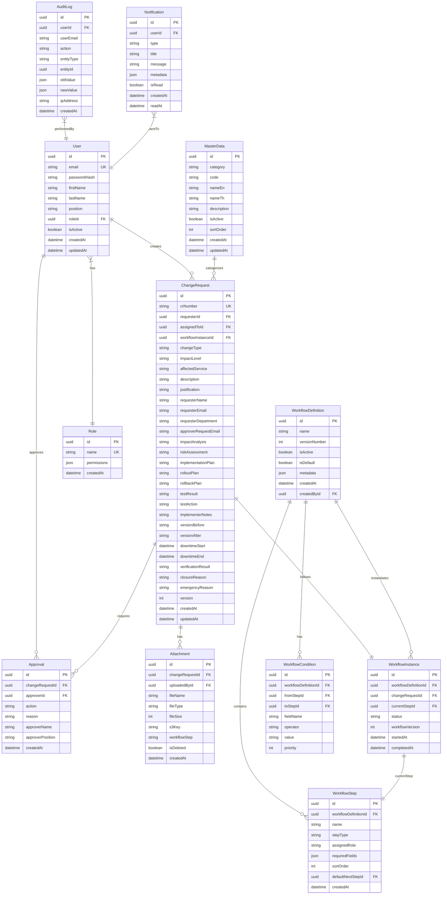

# Data Model

## Overview
**Database**: Microsoft SQL Server Express
**ORM**: Prisma (schema-first, type-safe, auto migrations)
**Strategy**: Relational model with immutable audit log (append-only), soft-delete for master data, version tracking for CR and workflow

---

## Entity Relationship Diagram

---

## Entities

### User

**Purpose**: ผู้ใช้งานระบบ (internal) ที่ต้อง login

| Field | Type | Required | Constraints | Description |
|-------|------|----------|-------------|-------------|
| id | UUID | Yes | PK, auto-generated | Unique identifier |
| email | String(255) | Yes | Unique, format: email | Company email |
| passwordHash | String(255) | Yes | bcrypt hashed | Hashed password |
| firstName | String(100) | Yes | | ชื่อ |
| lastName | String(100) | Yes | | นามสกุล |
| position | String(100) | No | | ตำแหน่ง |
| roleId | UUID | Yes | FK → Role.id | Role assignment |
| isActive | Boolean | Yes | Default: true | Active/deactivated |
| createdAt | DateTime | Yes | Auto | Creation timestamp |
| updatedAt | DateTime | Yes | Auto | Last update |

**Indexes**: Unique(email), Index(roleId), Index(isActive)

---

### Role

**Purpose**: กลุ่มสิทธิ์ — 8 roles ตาม business requirements

| Field | Type | Required | Constraints | Description |
|-------|------|----------|-------------|-------------|
| id | UUID | Yes | PK | |
| name | String(50) | Yes | Unique | Role name (e.g. "admin", "it_reviewer") |
| permissions | JSON | Yes | | Permission matrix |
| createdAt | DateTime | Yes | Auto | |

**Pre-seeded Roles**: requester, approver_request, call_center, it_reviewer, approver, implementer, auditor, admin

---

### ChangeRequest

**Purpose**: คำขอ Change Request — entity หลักของระบบ

| Field | Type | Required | Constraints | Description |
|-------|------|----------|-------------|-------------|
| id | UUID | Yes | PK | |
| crNumber | String(20) | Yes | Unique, format: CR-YYYY-NNNN | Running number |
| requesterId | UUID | No | FK → User.id (null for anonymous) | ผู้สร้าง (null = anonymous) |
| assignedToId | UUID | No | FK → User.id | IT Reviewer ที่ถูก assign |
| workflowInstanceId | UUID | Yes | FK → WorkflowInstance.id | Current workflow |
| changeType | String(20) | Yes | enum: normal, emergency | ประเภท Change |
| impactLevel | String(20) | Yes | enum: major, high, medium, low, very_low | ระดับผลกระทบ |
| affectedService | String(100) | Yes | | Service ที่ได้รับผลกระทบ |
| description | Text | Yes | | รายละเอียด Change |
| justification | Text | No | | เหตุผล |
| requesterName | String(200) | Yes | | ชื่อผู้ร้องขอ |
| requesterEmail | String(255) | Yes | | Email ผู้ร้องขอ |
| requesterDepartment | String(100) | No | | แผนก |
| approverRequestEmail | String(255) | No | | Email หัวหน้าผู้ร้องขอ |
| impactAnalysis | Text | No | | ผลวิเคราะห์ Impact (IT fills) |
| riskAssessment | Text | No | | ผลประเมิน Risk (IT fills) |
| implementationPlan | Text | No | | แผนดำเนินการ |
| rolloutPlan | Text | No | | แผน Rollout |
| rollbackPlan | Text | No | | แผน Rollback |
| testResult | String(20) | No | enum: pass, failed, pending | ผลทดสอบ |
| testAction | String(50) | No | enum: restore, vendor, retest, other | Action เมื่อ test failed |
| implementerNotes | Text | No | | บันทึก deployment |
| versionBefore | String(100) | No | | Version ก่อนเปลี่ยน |
| versionAfter | String(100) | No | | Version หลังเปลี่ยน |
| downtimeStart | DateTime | No | | เริ่มหยุดบริการ |
| downtimeEnd | DateTime | No | | สิ้นสุดหยุดบริการ |
| verificationResult | String(20) | No | enum: success, failed | ผล verification |
| closureReason | Text | No | | เหตุผลปิด CR |
| emergencyReason | Text | No | | เหตุผล Emergency |
| version | Int | Yes | Default: 1, increment on update | Optimistic locking |
| createdAt | DateTime | Yes | Auto | |
| updatedAt | DateTime | Yes | Auto | |

**Indexes**: Unique(crNumber), Index(assignedToId), Index(changeType), Index(impactLevel), Index(createdAt), Index(requesterEmail)

---

### WorkflowDefinition

**Purpose**: Template ของ workflow ที่ Admin กำหนด

| Field | Type | Required | Constraints | Description |
|-------|------|----------|-------------|-------------|
| id | UUID | Yes | PK | |
| name | String(100) | Yes | | ชื่อ workflow |
| versionNumber | Int | Yes | Default: 1 | Version ของ definition |
| isActive | Boolean | Yes | Default: true | Active/archived |
| isDefault | Boolean | Yes | Default: false | Default workflow สำหรับ CR ใหม่ |
| metadata | JSON | No | | Additional config |
| createdAt | DateTime | Yes | Auto | |
| createdById | UUID | Yes | FK → User.id | Admin ที่สร้าง |

---

### WorkflowStep

**Purpose**: แต่ละ step ใน workflow

| Field | Type | Required | Constraints | Description |
|-------|------|----------|-------------|-------------|
| id | UUID | Yes | PK | |
| workflowDefinitionId | UUID | Yes | FK | Belongs to workflow |
| name | String(100) | Yes | | ชื่อ step (e.g. "IT Review") |
| stepType | String(30) | Yes | enum: start, review, approval, implementation, verification, end | ประเภท step |
| assignedRole | String(50) | Yes | | Role ที่รับผิดชอบ |
| requiredFields | JSON | No | | Fields ที่ต้องกรอกก่อนไป step ถัดไป |
| sortOrder | Int | Yes | | ลำดับ (for display) |
| defaultNextStepId | UUID | No | FK → WorkflowStep.id | Default next step |
| createdAt | DateTime | Yes | Auto | |

---

### WorkflowCondition

**Purpose**: เงื่อนไขในการ route ระหว่าง steps

| Field | Type | Required | Constraints | Description |
|-------|------|----------|-------------|-------------|
| id | UUID | Yes | PK | |
| workflowDefinitionId | UUID | Yes | FK | |
| fromStepId | UUID | Yes | FK → WorkflowStep.id | Step ต้นทาง |
| toStepId | UUID | Yes | FK → WorkflowStep.id | Step ปลายทาง |
| fieldName | String(100) | Yes | | Field ที่ evaluate (e.g. "impactLevel") |
| operator | String(20) | Yes | enum: equals, not_equals, in, greater_than | |
| value | String(255) | Yes | | ค่าที่เทียบ |
| priority | Int | Yes | Default: 0 | ลำดับ priority (evaluate first match) |

---

### AuditLog

**Purpose**: Immutable audit trail — append-only, ห้าม UPDATE/DELETE

| Field | Type | Required | Constraints | Description |
|-------|------|----------|-------------|-------------|
| id | UUID | Yes | PK | |
| userId | UUID | No | FK → User.id (null for anonymous) | |
| userEmail | String(255) | Yes | | Email ผู้กระทำ |
| action | String(50) | Yes | | e.g. "create", "update", "approve" |
| entityType | String(50) | Yes | | e.g. "ChangeRequest", "Workflow" |
| entityId | UUID | Yes | | ID ของ entity ที่ถูกกระทำ |
| oldValue | JSON | No | | ค่าเดิม (null for create) |
| newValue | JSON | No | | ค่าใหม่ (null for delete) |
| ipAddress | String(45) | No | | Client IP |
| createdAt | DateTime | Yes | Auto, DB-level default | Timestamp |

**Constraints**: NO UPDATE, NO DELETE (DB-level trigger/policy)
**Index**: Index(entityType, entityId), Index(userId), Index(createdAt), Index(action)

---

## Data Access Patterns

| Query | Frequency | Index Used |
|-------|-----------|------------|
| Get CR by ID | Very High | PK |
| List CRs by assignedTo + status | High | Index(assignedToId) + filter |
| Search CRs by crNumber | High | Unique(crNumber) |
| List CRs by requesterEmail | Medium | Index(requesterEmail) |
| List CRs by date range | Medium | Index(createdAt) |
| Get audit logs by entity | High | Index(entityType, entityId) |
| List notifications by userId + unread | High | Index(userId, isRead) |
| Get workflow steps by definitionId | Medium | FK index |
| Dashboard aggregations | Low | Full scan with date filter |
