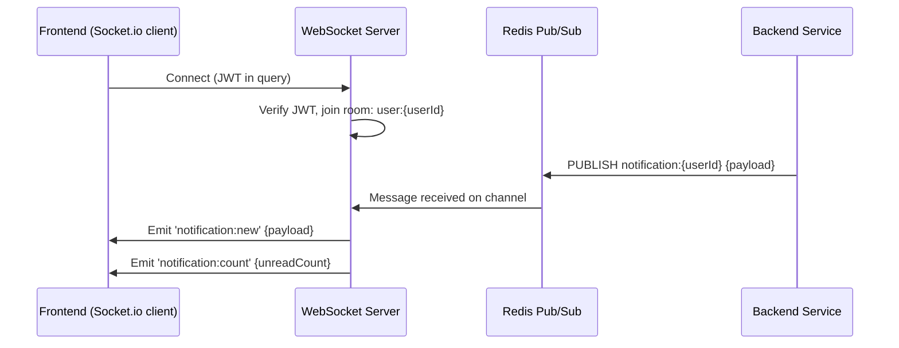

# Integration Specifications

## Overview
ระบบ ACR Management System เชื่อมต่อกับ 3 external services หลัก (Phase 1): AWS SES (email), AWS S3 (file storage), Redis (cache + pub/sub). Active Directory integration เป็น Phase 2.

---

## External Integrations

### AWS SES (Email)

**Purpose**: ส่ง email notifications — approval links, status updates, tracking links
**Type**: AWS SDK (REST API)
**Auth**: IAM Role (ECS task role) — ไม่ต้อง manage credentials ในโค้ด

**Key Operations**:
- `ses.sendEmail()` — ส่ง email ทั่วไป (status update, approval link)
- `ses.sendTemplatedEmail()` — ส่ง email จาก template (consistent format)

**Email Templates**:
| Template | Trigger | Recipients |
|----------|---------|------------|
| cr-pre-approval | Requester submits for pre-approval | Approver Request (หัวหน้า) |
| cr-submitted-to-it | Pre-approval done, submit to IT | IT central email (Service@dits.co.th) |
| cr-assigned | Call Center assigns to IT | Assigned IT Reviewer |
| cr-pending-approval | IT submits for approval | Approver |
| cr-approved | Approver approves | IT Reviewer, Implementer |
| cr-rejected | Approver rejects | IT Reviewer, Requester |
| cr-completed | CR closed | Requester, IT Reviewer |
| cr-tracking-link | CR created | Requester (tracking token) |
| password-reset | Forgot password | User |

**Error Handling**:
- Retry: Exponential backoff, 3 attempts (1s, 3s, 9s)
- Timeout: 10s per request
- Fallback: Queue failed emails in DB, retry via background job (every 5min)
- Bounces: Log in audit, do not retry

**Rate Limits**: SES production — 50 emails/sec (sufficient for internal system)

---

### AWS S3 (Attachments)

**Purpose**: เก็บ file attachments (evidence, screenshots, logs, documents)
**Type**: AWS SDK (REST API)
**Auth**: IAM Role (ECS task role)

**Bucket Structure**:
```
acr-attachments-{env}/
  ├── {crId}/
  │   ├── {attachmentId}-{originalFileName}
  │   └── ...
  └── ...
```

**Key Operations**:
- `s3.getSignedUrl('putObject')` — generate presigned upload URL (5min expiry)
- `s3.getSignedUrl('getObject')` — generate presigned download URL (15min expiry)
- `s3.deleteObject()` — physical delete (triggered by admin cleanup job, not user action)

**Validation (Backend validates before generating upload URL)**:
- File type: PDF, JPG, PNG, DOCX, XLSX, TXT, LOG
- File size: ≤ 10MB (configurable via system config)
- Content-Type header must match declared file type

**Error Handling**:
- Upload timeout: 60s (presigned URL validity: 5min)
- Download timeout: 15min (presigned URL)
- S3 unavailable: Return 503, log error, retry on next request
- Virus scan: Out of scope Phase 1 (future: S3 event → Lambda → ClamAV)

---

### Redis (Cache + Pub/Sub)

**Purpose**: Session cache, master data cache, workflow state cache, real-time notification pub/sub
**Type**: Redis client (ioredis)
**Auth**: Redis AUTH password (Secrets Manager)

**Usage Patterns**:

| Key Pattern | Purpose | TTL |
|-------------|---------|-----|
| `session:{userId}` | JWT session validation | 24h |
| `master:{category}` | Master data cache | 1h (invalidate on change) |
| `workflow:{instanceId}` | Current workflow state | 30min |
| `token:{tokenId}` | Anonymous/approval tokens | configurable (24h/72h) |
| `rate:{ip}:{endpoint}` | Rate limiting counters | 1min |

**Pub/Sub Channels**:
| Channel | Publisher | Subscriber | Purpose |
|---------|-----------|------------|---------|
| `notification:{userId}` | Backend (any module) | WebSocket server | Push real-time notifications |

**Error Handling**:
- Connection lost: Reconnect with exponential backoff (max 30s)
- Fallback: If Redis unavailable, degrade gracefully:
  - Sessions: Fall back to stateless JWT validation (skip revocation check)
  - Master data: Query DB directly
  - Notifications: Queue in memory, deliver when reconnected
  - Rate limiting: Skip (allow all requests)

---

## Internal Communication (WebSocket)

### Socket.io Server

**Purpose**: Real-time in-app notifications push
**Transport**: WebSocket (upgrade from HTTP) + fallback to long-polling
**Auth**: JWT token passed in connection handshake
**Namespace**: `/notifications`

**Flow**:


**Scaling (Future)**: Socket.io Redis adapter สำหรับ multi-instance (ECS tasks)

---

## Phase 2 Integrations (Not Implemented Now)

### Active Directory (AD)

**Purpose**: SSO login, user profile sync, role mapping from AD groups
**Planned Approach**: Microsoft MSAL + OIDC
**Prerequisite**: AD tenant configuration, app registration in Azure AD
**Impact on current design**: Auth module ใช้ Strategy pattern — plug AD strategy ได้โดยไม่แก้ core logic

---

## Integration Testing

**Strategy**:
- **AWS SES**: Mock via `@aws-sdk/client-ses-mock` ใน unit/integration tests; real SES ใน staging
- **AWS S3**: LocalStack (Docker) สำหรับ local dev/test; real S3 ใน staging
- **Redis**: Real Redis (Docker) ใน local; mock-redis สำหรับ unit tests
- **WebSocket**: Socket.io client ใน integration tests

**Docker Compose (local dev)**:
```yaml
services:
  mssql:
    image: mcr.microsoft.com/mssql/server:2022-latest
  redis:
    image: redis:7-alpine
  localstack:
    image: localstack/localstack
    environment:
      - SERVICES=s3,ses
```
