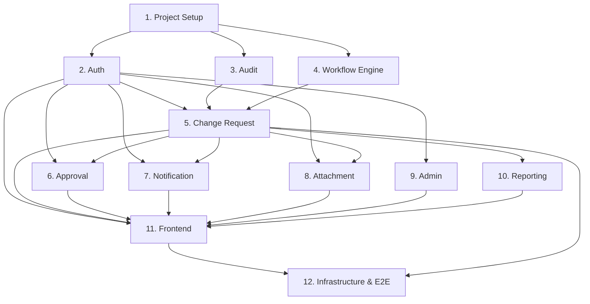

# Implementation Tasks — ACR Management System

## Summary
- **Total Tasks**: 48 across 12 phases
- **Execution Waves**: 5 waves (3 parallel waves)
- **Strategy**: Component-first, TDD, parallel by module
- **Estimates**: T-shirt sizes (S=0.5d, M=1d, L=2d, XL=3d+)

---

## Tasks

- [x] 1. Project Setup & Infrastructure Foundation
  - [x] 1.1 Initialize monorepo with pnpm workspaces (packages/frontend, packages/backend, packages/shared, infra/) [S]
    - Create root package.json, pnpm-workspace.yaml, .nvmrc (Node 20), .gitignore
    - Configure TypeScript base config (tsconfig.base.json)
    - Setup ESLint + Prettier (shared config)
  - [x] 1.2 Setup backend NestJS project [M]
    - Initialize NestJS project in packages/backend
    - Configure NestJS with Swagger, Helmet, CORS, compression
    - Setup environment validation (Zod config schema)
    - Create health check endpoint (GET /api/v1/health)
  - [x] 1.3 Setup frontend React project [M]
    - Initialize Vite + React + TypeScript in packages/frontend
    - Configure Tailwind CSS + MUI theme (custom DITS theme)
    - Setup React Router with layout structure
    - Configure proxy to backend (vite.config.ts)
  - [x] 1.4 Setup Docker Compose (local dev) [M]
    - docker-compose.yml: MSSQL 2022, Redis 7, LocalStack (S3, SES)
    - Environment file (.env.example) with all variables
    - Health check scripts for services
  - [x] 1.5 Setup Prisma with MSSQL [M]
    - Install Prisma, configure datasource for MSSQL
    - Create initial schema (all 12 entities from data-model.md)
    - Generate initial migration
    - Create seed script (roles, default workflow, admin user)
  - [x] 1.6 Setup shared package [S]
    - Create packages/shared with TypeScript types, constants (roles, statuses, enums)
    - Export interfaces: IChangeRequest, IUser, IWorkflowDefinition, etc.

- [x] 2. Auth Module (Backend)
  - [x] 2.1 Implement User entity + Prisma model [S]
    - User, Role models with relationships
    - Seed 8 default roles with permission matrices
  - [x] 2.2 Implement local auth service (register, login, password hash) [L]
    - AuthService: register (admin-only), login (email+password→JWT)
    - bcrypt password hashing, JWT access+refresh token generation
    - Tests: registration flow, login success/failure, password hashing
  - [x] 2.3 Implement JWT guards and RBAC [L]
    - JwtAuthGuard, RolesGuard (decorator-based @Roles())
    - Permission matrix check per endpoint
    - Tests: guard allows/denies based on role, expired token rejection
  - [x] 2.4 Implement anonymous token system [M]
    - Generate tracking tokens for anonymous requesters (stored in Redis, 24h expiry)
    - Generate approval link tokens (one-time, 72h expiry)
    - Token verification endpoint
    - Tests: token generation, expiry, one-time use
  - [x] 2.5 Implement auth controllers (REST endpoints) [M]
    - POST /auth/register, /auth/login, /auth/refresh, /auth/forgot-password, /auth/reset-password
    - GET /auth/me, /auth/verify-token/:token
    - Swagger decorators
    - Integration tests with Supertest

- [x] 3. Audit Module (Backend)
  - [x] 3.1 Implement AuditLog entity + immutability constraints [M]
    - Prisma model, DB-level trigger to prevent UPDATE/DELETE
    - AuditService: create entry (append-only)
    - Tests: create succeeds, update/delete throws
  - [x] 3.2 Implement AuditInterceptor (auto-capture) [L]
    - NestJS interceptor that captures before/after values on write operations
    - Attach to all controllers via global interceptor
    - Tests: interceptor logs create, update, status change actions
  - [x] 3.3 Implement audit query endpoints [M]
    - GET /audit-logs (search, filter, paginate)
    - GET /audit-logs/entity/:type/:id
    - Auditor/Admin role guard
    - Tests: filtering, pagination, permission check
  - [x] 3.4 PBT: Audit immutability + completeness properties [M]
    - Property 3: entries cannot be modified after creation
    - Property 4: every write generates audit entry
    - fast-check generators and assertions

- [x] 4. Workflow Engine Module (Backend)
  - [x] 4.1 Implement WorkflowDefinition, WorkflowStep, WorkflowCondition entities [M]
    - Prisma models with relationships
    - Seed default workflow (Draft→Submitted→IT Review→Approval→Implementation→Verification→Closed)
  - [x] 4.2 Implement WorkflowDefinitionService (CRUD + versioning) [L]
    - Create/update workflow definitions (new version on update)
    - Activate/deactivate workflows
    - Tests: version increment on update, active flag management
  - [x] 4.3 Implement WorkflowEngine (state machine + condition evaluation) [XL]
    - WorkflowEngineService: createInstance, transition, evaluateConditions
    - State machine: validate transition against definition edges
    - Condition evaluation: field-based routing (priority-ordered, first-match)
    - Workflow versioning: instance locked to definition version at creation
    - Tests: valid/invalid transitions, condition routing, version locking
  - [x] 4.4 Implement WorkflowValidator [M]
    - Validate integrity: has start, has end, all steps reachable, no orphans
    - Validate on save (admin cannot save invalid workflow)
    - Tests: valid flow passes, invalid flows rejected (orphan, no end, cycle)
  - [x] 4.5 Implement workflow admin controllers [M]
    - CRUD endpoints for workflows, steps, conditions
    - POST /workflows/:id/validate
    - Admin role guard
    - Integration tests
  - [x] 4.6 PBT: Workflow state machine properties [L]
    - Property 1: valid transitions only
    - Property 2: reachability (all steps reachable from start)
    - fast-check generators for workflow definitions and transition sequences

- [x] 5. Change Request Module (Backend)
  - [x] 5.1 Implement ChangeRequest entity + Prisma model [M]
    - Full schema with all fields, version field for optimistic locking
    - CR number auto-generation (CR-YYYY-NNNN)
    - Relationships: user, workflow instance, attachments, approvals
  - [x] 5.2 Implement ChangeRequestService (CRUD + lifecycle) [L]
    - Create CR (anonymous or authenticated)
    - Update CR fields (with version check — optimistic locking)
    - Field-level validation based on current workflow step (requiredFields from step config)
    - Tests: create, update, version conflict detection
  - [x] 5.3 Implement CR workflow transitions [L]
    - Submit (trigger pre-approval flow)
    - Assign (Call Center → IT Reviewer)
    - Submit for approval, Approve, Reject
    - Implement, Verify, Close
    - Each transition: validate prerequisites, call WorkflowEngine, trigger notifications
    - Tests: full flow transitions, prerequisite validation, Emergency flow
  - [x] 5.4 Implement CR search & history [M]
    - Search with multiple filters (ID, status, service, date, requester, changeType, impactLevel)
    - Pagination + sorting
    - History endpoint (from audit log)
    - Tests: filter combinations, pagination, role-based filtering
  - [x] 5.5 Implement CR controllers (REST endpoints) [M]
    - All endpoints from api-spec.md (ChangeRequests section)
    - Swagger decorators, Zod validation pipes
    - Integration tests
  - [x] 5.6 PBT: Optimistic locking property [M]
    - Property 6: concurrent updates with stale version must fail
    - fast-check generators for concurrent scenarios

- [x] 6. Approval Module (Backend)
  - [x] 6.1 Implement Approval entity + ApprovalService [M]
    - Approval model (approve/reject + reason)
    - Submit for approval, approve, reject logic
    - BR-010 check (approver ≠ implementer) — warning only
    - Tests: approve flow, reject requires reason, BR-010 warning
  - [x] 6.2 Implement Emergency Change post-approval flow [M]
    - Allow implementation before approval for Emergency type
    - Force post-approval before close
    - Tests: emergency flow, post-approval enforcement
  - [x] 6.3 Implement approval controllers [S]
    - POST /change-requests/:id/approve, /reject
    - GET /approvals/pending
    - Integration tests

- [x] 7. Notification Module (Backend)
  - [x] 7.1 Implement NotificationService + email templates [L]
    - NotificationService: send email via AWS SES, store in-app notification
    - Email templates (9 types from integration.md)
    - Queue failed emails for retry (DB-backed queue)
    - Tests: template rendering, SES mock calls, retry logic
  - [x] 7.2 Implement WebSocket gateway (Socket.io) [M]
    - NestJS WebSocket gateway on /notifications namespace
    - JWT auth in handshake
    - Push notifications via Redis pub/sub
    - Tests: connection auth, notification delivery, room management
  - [x] 7.3 Implement notification controllers [S]
    - GET /notifications, /notifications/unread-count
    - PATCH /notifications/:id/read, /notifications/read-all
    - Integration tests
  - [x] 7.4 PBT: RBAC permission enforcement [M]
    - Property 5: unauthorized operations return 403
    - fast-check generators for role + operation combinations

- [x] 8. Attachment Module (Backend)
  - [x] 8.1 Implement AttachmentService (S3 presigned URLs) [M]
    - Generate presigned upload/download URLs
    - Validate file type + size
    - Link attachments to CR + workflow step
    - Tests: URL generation, validation (type, size), linking
  - [x] 8.2 Implement attachment controllers [S]
    - POST /attachments/upload-url, /attachments/confirm
    - GET /attachments/:id/download-url
    - DELETE /attachments/:id (soft delete)
    - Integration tests

- [x] 9. Admin Module (Backend)
  - [x] 9.1 Implement User management CRUD [M]
    - Create/update/deactivate users
    - Role assignment (multiple roles per user)
    - Tests: CRUD operations, role changes, deactivation
  - [x] 9.2 Implement Master Data CRUD [M]
    - Services, Impact Levels, Change Types — CRUD with soft-disable
    - Cache invalidation on change (Redis)
    - Tests: CRUD, soft-disable preserves references, cache invalidation
  - [x] 9.3 Implement admin controllers [S]
    - All /admin/* endpoints from api-spec.md
    - Admin role guard
    - Integration tests

- [x] 10. Reporting Module (Backend)
  - [x] 10.1 Implement Dashboard statistics [M]
    - CR count by month, by status, by impact, by change type
    - Average time to close
    - SQL aggregation queries
    - Tests: aggregation accuracy, role-based filtering
  - [x] 10.2 Implement Export (Excel/PDF) [L]
    - Excel export (ExcelJS) with filtered data
    - PDF export (PDFKit) with formatted report
    - Permission-based data filtering
    - Tests: export format, data matches filter, file generation

- [x] 11. Frontend Implementation
  - [x] 11.1 Setup routing, layouts, and shared components [M]
    - React Router: public routes (CR form, tracking, approval link) + protected routes (dashboard, admin)
    - Layout: Sidebar + Header + Content area
    - Shared UI: Table, Modal, Toast, LoadingSpinner, ErrorBoundary
  - [x] 11.2 Implement Auth pages (Login, ForgotPassword) + auth hooks [M]
    - Login page (email + password → JWT)
    - ForgotPassword / ResetPassword pages
    - useAuth hook (login, logout, token refresh, currentUser)
    - Zustand auth store
  - [x] 11.3 Implement CR form (create + edit) — Requester view [L]
    - Multi-section form (React Hook Form + Zod)
    - Change Type, Impact Level, Affected Service (master data dropdowns)
    - Anonymous mode (no login required)
    - Pre-approval flow (send email to approver request)
    - File upload (presigned URL flow)
  - [x] 11.4 Implement CR list + detail + tracking pages [L]
    - List page: table with search/filter/sort/pagination
    - Detail page: show CR info, current status, history timeline
    - Tracking page (anonymous — accessible via token link)
  - [x] 11.5 Implement IT Review + Approval views [L]
    - IT Review form: Impact Analysis, Risk, Plans, Test Result
    - Approval queue: list pending, summary view, Approve/Reject buttons
    - Approval link page (anonymous — token-based)
  - [x] 11.6 Implement Admin pages (Users, Master Data, Workflow Config) [L]
    - User management: list, create, edit roles
    - Master Data: CRUD tables for services, impact levels, change types
    - Workflow Config: visual step list, add/edit/delete steps, conditions, validate
  - [x] 11.7 Implement Notifications (in-app + badge) [M]
    - Notification bell with unread count badge
    - Notification dropdown/panel
    - Socket.io client for real-time updates
    - Mark read/mark all read
  - [x] 11.8 Implement Dashboard + Reporting pages [M]
    - Dashboard: charts (recharts) — CR by month, by status, by impact
    - Export button (Excel/PDF download)

- [x] 12. Infrastructure & CI/CD
  - [x] 12.1 Terraform modules (VPC, ECS, RDS, ElastiCache, S3, CloudFront, SES) [XL]
    - VPC with public/private subnets (2 AZs)
    - ECS Fargate service (backend) with ALB
    - RDS MSSQL Express (db.t3.small, encrypted)
    - ElastiCache Redis (cache.t3.micro)
    - S3 buckets: frontend static + attachments
    - CloudFront distribution for frontend
    - SES configuration + verified domain
    - Separate staging/production tfvars
  - [x] 12.2 Dockerfiles (backend, frontend build) [M]
    - Backend: multi-stage build (builder → runner)
    - Frontend: build stage → copy to S3 (via CI)
    - .dockerignore files
  - [x] 12.3 GitHub Actions CI/CD pipeline [L]
    - ci.yml: lint → unit test → build → integration test (on PR)
    - deploy.yml: build → push ECR → deploy ECS (staging: auto on develop, prod: manual on main)
    - Frontend: build → sync S3 → invalidate CloudFront
  - [x] 12.4 E2E test setup (Playwright) [M]
    - Playwright config
    - Critical flow tests: create CR → assign → review → approve → implement → verify → close
    - Auth flow tests: login, anonymous CR, approval link

---

## Execution Waves

### Wave 1 — Foundation (Sequential)
| Phase | Description | File Ownership |
|-------|-------------|----------------|
| 1. Project Setup | Monorepo, NestJS, React, Docker, Prisma | `*` (all files — foundation) |

### Wave 2 — Core Backend (Parallel)
| Phase | Description | File Ownership |
|-------|-------------|----------------|
| 2. Auth Module | Authentication, JWT, RBAC, tokens | `packages/backend/src/modules/auth/`, `packages/backend/src/common/guards/`, `packages/backend/src/common/decorators/` |
| 3. Audit Module | Immutable audit log, interceptor | `packages/backend/src/modules/audit/`, `packages/backend/src/common/interceptors/audit*` |
| 4. Workflow Engine | State machine, conditions, versioning | `packages/backend/src/modules/workflow/` |

### Wave 3 — Business Logic (Parallel)
| Phase | Description | File Ownership |
|-------|-------------|----------------|
| 5. Change Request | CR lifecycle, CRUD, transitions | `packages/backend/src/modules/change-request/` |
| 6. Approval | Approve/reject, emergency flow | `packages/backend/src/modules/approval/` |
| 7. Notification | Email (SES), WebSocket, templates | `packages/backend/src/modules/notification/` |
| 8. Attachment | S3 presigned URLs, file validation | `packages/backend/src/modules/attachment/` |

### Wave 4 — Supporting Features (Parallel)
| Phase | Description | File Ownership |
|-------|-------------|----------------|
| 9. Admin Module | User CRUD, Master Data, config | `packages/backend/src/modules/admin/` |
| 10. Reporting | Dashboard stats, Excel/PDF export | `packages/backend/src/modules/reporting/` |
| 11. Frontend | All React pages and components | `packages/frontend/` |

### Wave 5 — Infrastructure & E2E (Sequential)
| Phase | Description | File Ownership |
|-------|-------------|----------------|
| 12. Infrastructure | Terraform, Docker, CI/CD, E2E tests | `infra/`, `.github/`, `Dockerfile*`, `docker-compose*` |

---

## Task Dependency Graph

